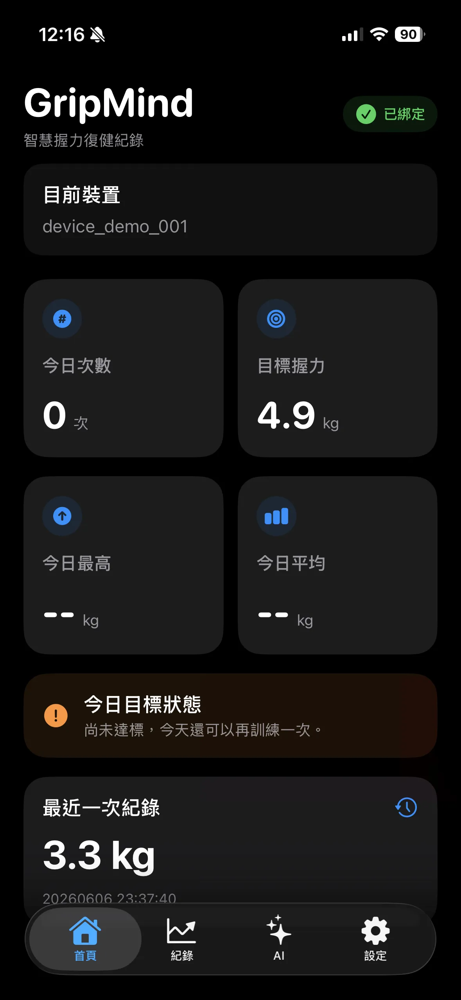
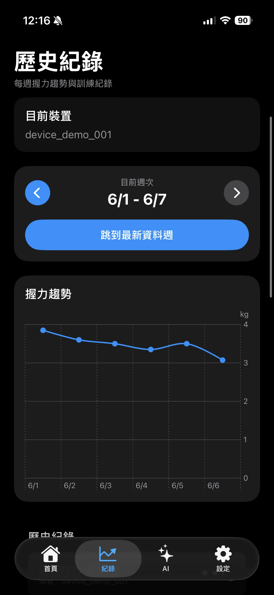
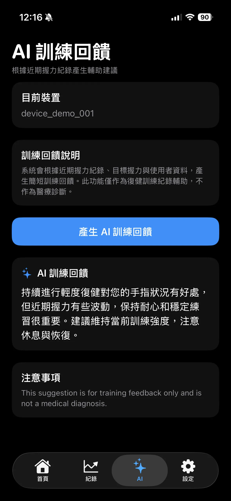
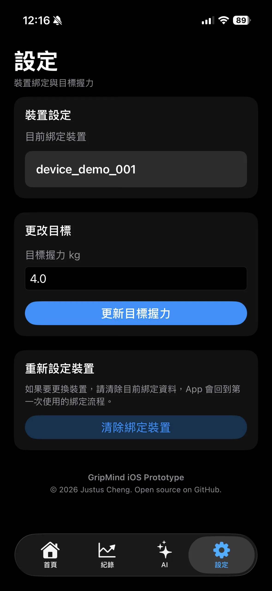

# GripMind iOS App

[繁體中文](README.zh-TW.md) | English

GripMind iOS App is the mobile client of the GripMind smart grip rehabilitation tracking system.

This repository contains the **iOS application only**. The app connects to an external Flask REST API for device binding, grip strength records, target settings, and AI-generated training feedback.

> The backend API, LINE Login callback handling, Ollama integration, and server deployment are not included in this repository.

---

## Overview

GripMind helps users track grip strength training data through an iOS app. It provides a simple rehabilitation-oriented interface for viewing daily grip summaries, checking weekly progress, updating target grip strength, and receiving AI-assisted training feedback.

The app is designed as a practical SwiftUI prototype that demonstrates:

* iOS app development
* REST API integration
* LINE Login based device binding
* Swift Charts data visualization
* MVVM architecture
* Pull-to-refresh data updates
* Dark mode compatible UI
* AI feedback display from an external backend service

> GripMind is for training feedback and learning purposes only. It is not a medical diagnosis tool.

---

## Screenshots

| Dashboard                            | Weekly History                     | AI Feedback                            | Settings                            |
| ------------------------------------ | ---------------------------------- | -------------------------------------- | ----------------------------------- |
|  |  |  |  |

---

## Core Features

### First-Time Device Binding

* User enters a `device_id` on first launch.
* The app opens an external LINE Login binding page.
* After successful binding, the backend redirects back to the app using a custom URL scheme.
* The app verifies the device profile and stores the device ID locally with `AppStorage`.

### Dashboard

* Shows today’s training count.
* Shows target grip strength.
* Shows today’s maximum grip.
* Shows today’s average grip.
* Shows the latest grip record.
* Shows LINE binding status.
* Supports pull-to-refresh.

### Weekly History

* Displays grip records by week.
* Supports switching between weeks.
* Groups multiple records on the same day into one daily average point.
* Uses Swift Charts to visualize grip strength trends.

### Target Settings

* Allows the user to update target grip strength.
* Uses the saved device ID automatically.
* Does not require repeated device ID input after binding.

### AI Training Feedback

* Calls the external backend AI analysis endpoint.
* Displays AI-generated training feedback.
* Includes a medical disclaimer.

---

## System Positioning

This repository is the **iOS client** of the GripMind system.

```text
GripMind iOS App
  |
  | HTTPS REST API
  v
External Flask Backend API
  |
  +--> LINE Login Binding
  |
  +--> Grip Records / User Profile Data
  |
  +--> Ollama AI Feedback
```

The backend service is expected to provide:

* RESTful API endpoints
* Device profile lookup
* Grip record storage
* Target grip update
* LINE Login callback handling
* Ollama AI analysis integration

---

## Tech Stack

### iOS

* Swift
* SwiftUI
* Swift Charts
* MVVM architecture
* AppStorage
* URLSession async/await
* Custom URL Scheme
* Adaptive light / dark mode UI

### External Services

* Flask REST API
* LINE Login
* Ollama local AI server
* Cloudflare Tunnel / Nginx deployment environment

---

## Project Structure

```text
GripMind
├── Assets.xcassets
├── ContentView.swift
├── DesignSystem
│   ├── GMAppHeader.swift
│   ├── GMCard.swift
│   ├── GMCopyrightFooter.swift
│   ├── GMDeviceCard.swift
│   ├── GMMessageCard.swift
│   ├── GMPrimaryButton.swift
│   ├── GMStatCard.swift
│   └── GMTheme.swift
├── GripMindApp.swift
├── Info.plist
├── Models
│   ├── AnalysisResponse.swift
│   ├── DailyGripAverage.swift
│   ├── DeviceProfileResponse.swift
│   ├── GripRecord.swift
│   ├── GripRecordsResponse.swift
│   ├── GripSummaryResponse.swift
│   ├── HealthResponse.swift
│   └── TargetUpdateResponse.swift
├── Services
│   └── APIClient.swift
├── ViewModels
│   ├── AnalysisViewModel.swift
│   ├── DashboardViewModel.swift
│   ├── HealthCheckViewModel.swift
│   ├── HistoryViewModel.swift
│   └── SettingsViewModel.swift
└── Views
    ├── AnalysisView.swift
    ├── DashboardView.swift
    ├── HistoryChartView.swift
    ├── HistoryView.swift
    ├── MainTabView.swift
    ├── OnboardingView.swift
    ├── RecordsListView.swift
    └── SettingsView.swift
```

---

## App Flow

### 1. Onboarding

When the app is opened for the first time, the user enters a device ID.

The app opens the external backend login URL:

```text
https://<BACKEND_DOMAIN>/login?device_id=<DEVICE_ID>&client=ios&app_callback_url=gripmind://bind-success
```

After LINE Login succeeds, the backend redirects back to the app:

```text
gripmind://bind-success?status=success&device_id=<DEVICE_ID>
```

The app then verifies the binding status through the profile API and stores the device ID locally.

---

### 2. Dashboard Data Loading

The dashboard uses the saved device ID to request summary data:

```http
GET /api/v1/devices/{device_id}/summary
GET /api/v1/devices/{device_id}/profile
```

The summary response is displayed as dashboard cards.

---

### 3. Weekly History Processing

The history page requests raw grip records:

```http
GET /api/v1/devices/{device_id}/records
```

The app then processes the records locally:

```text
Raw grip records
  → Parse timestamp
  → Group by day
  → Calculate daily average
  → Filter selected week
  → Display with Swift Charts
```

This avoids overcrowding the chart when there are multiple records on the same day.

---

### 4. Target Update

The settings page updates target grip strength:

```http
PATCH /api/v1/devices/{device_id}/target
```

Example request body:

```json
{
  "target_weight": 4.0
}
```

---

### 5. AI Feedback

The AI feedback page calls:

```http
POST /api/v1/devices/{device_id}/analysis
```

The backend generates training feedback using an Ollama-powered AI service and returns it to the app.

---

## Main API Endpoints

The iOS app expects the external backend to provide the following endpoints:

| Method | Endpoint                               | Description                           |
| ------ | -------------------------------------- | ------------------------------------- |
| GET    | `/api/v1/health`                       | Check backend service status          |
| GET    | `/api/v1/devices/{device_id}/profile`  | Get device profile and binding status |
| GET    | `/api/v1/devices/{device_id}/summary`  | Get daily grip summary                |
| GET    | `/api/v1/devices/{device_id}/records`  | Get grip history records              |
| PATCH  | `/api/v1/devices/{device_id}/target`   | Update target grip strength           |
| POST   | `/api/v1/devices/{device_id}/analysis` | Generate AI training feedback         |

For details, see:

```text
docs/api.md
```

---

## Local iOS Setup

### Requirements

* macOS
* Xcode
* iOS 16.0 or later
* Swift Charts support

### Steps

1. Clone the repository:

```bash
git clone https://github.com/cloud-driver/gripmind.git
cd gripmind
```

2. Open the Xcode project:

```bash
open GripMind.xcodeproj
```

3. Configure the API base URL in:

```text
GripMind/Services/APIClient.swift
```

Example:

```swift
private let baseURL = "https://your-backend-domain.example.com/api/v1"
```

4. Configure the URL Scheme in Xcode:

```text
Target → Info → URL Types
```

Recommended scheme:

```text
gripmind
```

5. Run the app with an iOS Simulator or physical iPhone.

---

## Documentation

| Document | Description |
|---|---|
| [`docs/app-setup.md`](docs/app-setup.md) | How to configure and run the iOS app locally |
| [`docs/architecture.md`](docs/architecture.md) | iOS app architecture, data flow, and external service integration |
| [`docs/api.md`](docs/api.md) | Backend API contract used by the iOS app |
| [`docs/backend-requirements.md`](docs/backend-requirements.md) | Required backend capabilities for the iOS app |
| [`docs/backend-deployment-notes.md`](docs/backend-deployment-notes.md) | Optional notes for the external backend deployment environment |
| [`docs/portfolio-note.md`](docs/portfolio-note.md) | Portfolio-oriented explanation of the project |

---

## Design System

The app includes a lightweight design system for consistent UI development.

| Component           | Purpose                                        |
| ------------------- | ---------------------------------------------- |
| `GMTheme`           | Shared colors, spacing, and corner radius      |
| `GMCard`            | Reusable card container                        |
| `GMStatCard`        | Dashboard statistic card                       |
| `GMDeviceCard`      | Current device display                         |
| `GMAppHeader`       | Fixed page header                              |
| `GMPrimaryButton`   | Main action button                             |
| `GMMessageCard`     | Success, warning, error, and info message card |
| `GMCopyrightFooter` | Footer information                             |

The UI uses adaptive system colors to support both light mode and dark mode.

---

## Error Handling

The app uses a centralized `APIClient` and `APIError` enum to handle network errors.

Handled cases include:

* Invalid URL
* Invalid response
* Server error status code
* JSON decoding failure
* Cancelled requests
* Unknown errors

This avoids placing raw `URLSession` logic inside SwiftUI views.

---

## Medical Disclaimer

GripMind provides training feedback based on grip strength records.

It is not intended to diagnose, treat, or replace professional medical advice. Users should consult healthcare professionals for medical decisions.

---

## Future Improvements

* Add authentication token support
* Add multi-device support
* Add HealthKit integration
* Add push notification reminders
* Add offline data caching
* Add training weekly reports
* Add unit tests for models and view models
* Add UI tests for main app flows
* Improve AI feedback display and prompt design
* Add support for more rehabilitation data types

---

## License

This project is open source. Please see the [`LICENSE`](LICENSE) file for details.
