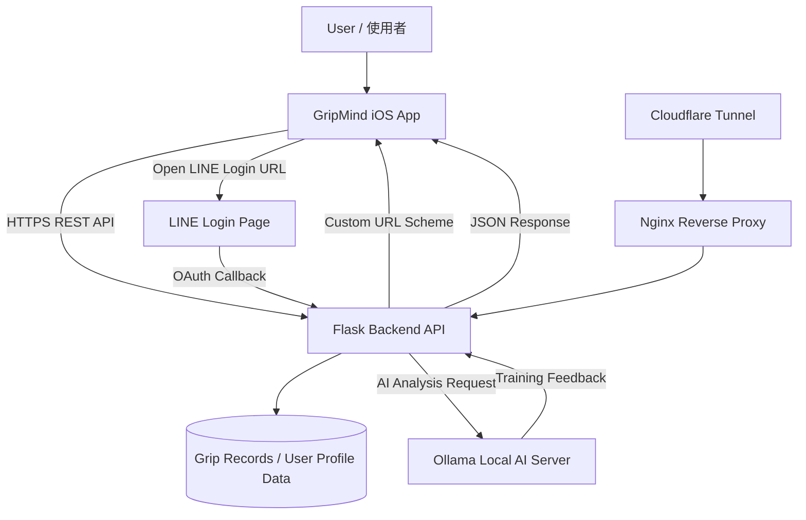
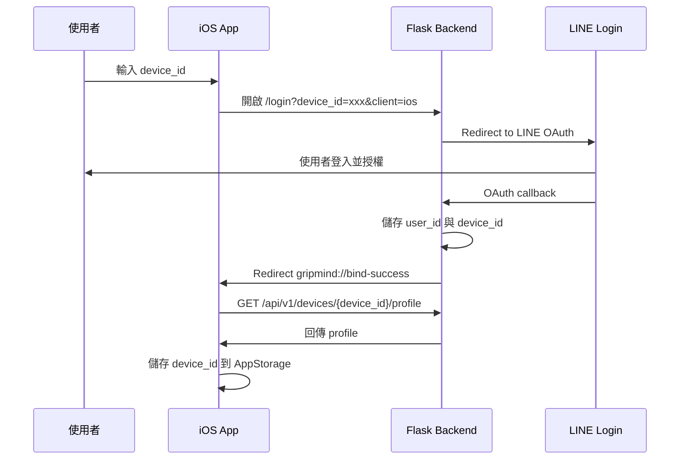
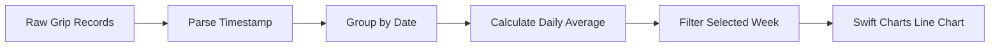
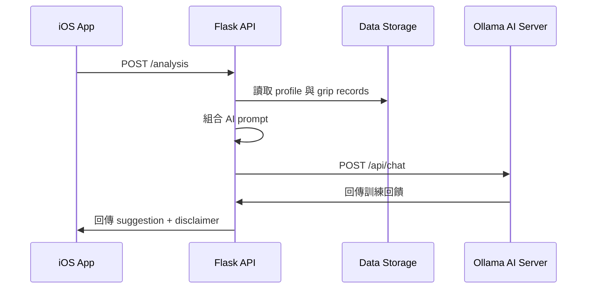
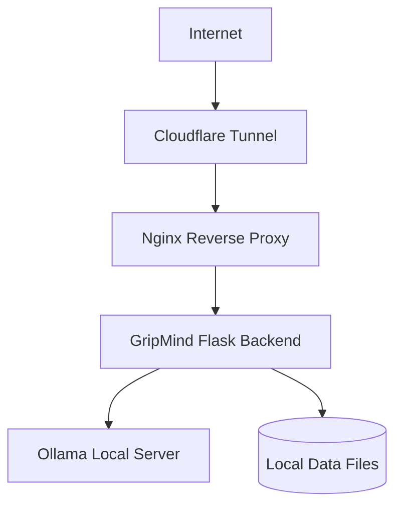

# GripMind 系統架構說明

GripMind 是一個結合 iOS App、Flask REST API、LINE Login 裝置綁定、本地 Ollama AI 回饋與雲端反向代理部署的智慧握力復健紀錄系統。

本文件說明 GripMind 的整體系統架構、資料流、登入綁定流程、iOS App 架構，以及後端與 AI 服務之間的整合方式。

---

## 1. 系統總覽

GripMind 的核心目標是讓使用者能夠透過 iOS App 查看握力訓練紀錄、追蹤每週復健趨勢、修改目標握力，並取得 AI 產生的訓練回饋。

整體系統分成五個主要部分：

1. iOS App
2. Flask Backend API
3. LINE Login 裝置綁定
4. Ollama Local AI Server
5. Cloudflare Tunnel / Nginx / systemd 部署環境

---

## 2. 整體架構圖



---

## 3. iOS App 架構

GripMind iOS App 採用 SwiftUI 與 MVVM 架構設計，將畫面、狀態管理、資料模型與 API 串接分層處理。

```text
GripMind
├── DesignSystem
├── Models
├── Services
├── ViewModels
└── Views
```

### 3.1 Views

`Views` 負責畫面呈現，不直接處理 API 細節。

主要畫面包括：

* `OnboardingView`

  * 第一次使用時輸入 `device_id`
  * 開啟 LINE Login 綁定流程
  * 綁定成功後儲存裝置 ID

* `DashboardView`

  * 顯示今日握力摘要
  * 顯示 LINE 綁定狀態
  * 支援下拉重新整理

* `HistoryView`

  * 顯示每週握力紀錄
  * 可切換週次
  * 圖表顯示每日平均握力

* `AnalysisView`

  * 呼叫 AI 分析 API
  * 顯示訓練回饋與注意事項

* `SettingsView`

  * 顯示目前綁定裝置
  * 修改目標握力
  * 清除綁定資料

---

### 3.2 ViewModels

`ViewModels` 負責畫面狀態與資料轉換。

主要 ViewModel：

* `DashboardViewModel`

  * 載入每日 summary
  * 檢查 LINE 綁定狀態
  * 處理重新整理與錯誤訊息

* `HistoryViewModel`

  * 載入歷史握力紀錄
  * 將原始紀錄整理成每日平均值
  * 管理目前顯示的週次

* `AnalysisViewModel`

  * 呼叫 AI 分析 API
  * 管理 loading、error、suggestion 狀態

* `SettingsViewModel`

  * 更新目標握力
  * 管理成功與錯誤訊息

---

### 3.3 Models

`Models` 負責對應後端 JSON Response。

主要資料模型：

* `GripRecord`
* `GripRecordsResponse`
* `GripSummaryResponse`
* `DailyGripAverage`
* `DeviceProfileResponse`
* `AnalysisResponse`
* `TargetUpdateResponse`
* `HealthResponse`

其中 `DailyGripAverage` 是 App 端整理後的圖表資料模型，用來將同一天的多筆握力紀錄轉換成單一平均點。

---

### 3.4 Services

`Services/APIClient.swift` 是 iOS App 與後端溝通的集中入口。

主要職責：

* 建立 API URL
* 發送 HTTP Request
* 使用 `URLSession async/await`
* 處理 HTTP status code
* Decode JSON response
* 將網路錯誤轉換為統一的 `APIError`

App 不直接在 View 裡呼叫 `URLSession`，避免畫面層與資料層混雜。

---

### 3.5 DesignSystem

GripMind 建立了簡易 Design System，讓畫面風格一致並方便維護。

主要元件：

* `GMTheme`

  * 管理顏色、間距、圓角
  * 支援深色模式與淺色模式

* `GMCard`

  * 統一卡片容器

* `GMStatCard`

  * 首頁數據卡片

* `GMAppHeader`

  * 固定頁面標題區

* `GMPrimaryButton`

  * 主要操作按鈕

* `GMMessageCard`

  * 成功、錯誤、警告、提示訊息

* `GMDeviceCard`

  * 目前綁定裝置資訊

---

## 4. LINE Login 裝置綁定流程

GripMind 的 LINE Login 並不是讓 iOS App 直接取得 LINE access token，而是透過後端完成裝置與 LINE 使用者的綁定。

### 流程說明

1. 使用者第一次開啟 App
2. App 要求輸入 `device_id`
3. App 開啟後端登入網址
4. 後端導向 LINE Login
5. 使用者完成 LINE Login
6. LINE 導回 Flask `/callback`
7. 後端儲存 LINE 使用者與裝置 ID 的關係
8. 後端透過 Custom URL Scheme 導回 iOS App
9. App 呼叫 `/profile` 確認綁定是否成功
10. App 將 `device_id` 儲存至 `AppStorage`

---

### LINE Login 流程圖



---

## 5. 資料讀取流程

### 5.1 首頁 Dashboard

首頁會讀取：

```http
GET /api/v1/devices/{device_id}/summary
GET /api/v1/devices/{device_id}/profile
```

用途：

* `/summary`

  * 今日訓練次數
  * 目標握力
  * 今日最高握力
  * 今日平均握力
  * 最近一次紀錄

* `/profile`

  * 確認裝置是否完成 LINE 綁定

---

### 5.2 歷史紀錄頁

歷史紀錄頁會呼叫：

```http
GET /api/v1/devices/{device_id}/records
```

App 取得原始握力紀錄後，會在 `HistoryViewModel` 中進行資料整理：

1. 解析每筆紀錄的 timestamp
2. 按日期分組
3. 計算同一天的平均握力
4. 產生 `DailyGripAverage`
5. 依目前選擇週次過濾資料
6. 傳給 `HistoryChartView` 顯示圖表

這樣可以避免同一天多筆資料造成圖表過度密集。

---

### 歷史紀錄資料轉換流程



---

## 6. AI 訓練回饋流程

AI 訓練回饋由後端呼叫 Ollama Local AI Server 產生。

iOS App 呼叫：

```http
POST /api/v1/devices/{device_id}/analysis
```

後端會整理使用者近期握力紀錄、目標握力與個人 Profile，組成 Prompt 後送給 Ollama。

Ollama 回傳文字後，後端再將結果包成 JSON Response 回傳給 App。

---

### AI 分析流程圖



---

## 7. 部署架構

後端部署於 Linux Server，透過 systemd 管理 Flask service，並使用 Nginx 與 Cloudflare Tunnel 對外公開服務。



部署組成：

* `systemd`

  * 管理 Flask Backend 常駐服務

* `Nginx`

  * 反向代理至 Flask Backend

* `Cloudflare Tunnel`

  * 將內部服務公開至指定網域

* `Ollama`

  * 在本地或私有伺服器上提供 AI 模型推論服務

---

## 8. 設計考量

### 8.1 為什麼使用 MVVM？

MVVM 可以讓 SwiftUI 畫面與資料邏輯分離：

* View 負責畫面
* ViewModel 負責狀態管理
* Model 負責資料結構
* Service 負責 API 呼叫

這樣在功能增加時，專案比較容易維護，也更容易除錯。

---

### 8.2 為什麼歷史圖表使用每日平均？

握力訓練可能在同一天產生多筆紀錄。若直接將每筆資料都畫在折線圖上，圖表會過度密集，不利於觀察長期趨勢。

因此 GripMind 在 App 端將同一天的資料整理成每日平均值，使圖表更適合作為復健趨勢觀察工具。

---

### 8.3 為什麼 AI 使用 Ollama？

Ollama 可以在本地或私有伺服器上執行大型語言模型，適合用於：

* 減少對外部 AI API 的依賴
* 保留資料控制權
* 降低長期 API 成本
* 展示本地 AI 整合能力

---

### 8.4 為什麼使用 Custom URL Scheme？

LINE Login 完成後，需要從瀏覽器或 LINE App 導回 iOS App。

Custom URL Scheme 讓後端可以透過：

```text
gripmind://bind-success
```

將使用者帶回 App，並讓 App 繼續完成綁定驗證流程。

---

## 9. 安全與限制

目前 GripMind 是 Prototype，仍有一些可改進之處：

* 尚未加入正式帳號系統
* 尚未加入 token-based API authentication
* 裝置 ID 目前仍依賴使用者輸入
* AI 回饋不應被視為醫療建議
* 本地資料儲存與權限控管仍可再強化

未來若要進一步產品化，應加入：

* API authentication
* User session management
* HTTPS-only production settings
* Rate limiting
* 更完整的資料庫設計
* 更嚴格的醫療免責聲明

---

## 10. 小結

GripMind 展示了一個從 iOS App 到後端 API、LINE Login、資料視覺化、AI 回饋與 Linux 部署的完整系統 Prototype。

此專案的重點不只是完成單一 App 畫面，而是整合多個實務開發環節：

* Mobile App Development
* RESTful API Integration
* OAuth Login Flow
* Data Visualization
* AI Service Integration
* Server Deployment
* UI Design System
* Project Documentation

這些能力共同構成 GripMind 的核心技術價值。
